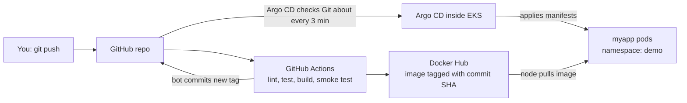

# EKS GitOps Demo: GitHub Actions → Docker Hub → Argo CD → Amazon EKS

A hands-on lab that takes a small Python web app from a `git push` all the way to a running Kubernetes deployment on Amazon EKS, using a CI pipeline (GitHub Actions) and GitOps delivery (Argo CD).

---

## Contents

1. [The big picture](#1-the-big-picture)
2. [How to read this guide (where to run things)](#2-how-to-read-this-guide-where-to-run-things)
3. [Repository layout and what each file does](#3-repository-layout-and-what-each-file-does)
4. [Progress checklist](#4-progress-checklist)
5. [Phase 1: GitHub, Docker Hub and the CI pipeline (DONE)](#5-phase-1-github-docker-hub-and-the-ci-pipeline-done)
6. [Phase 2: Install and configure your laptop tools](#6-phase-2-install-and-configure-your-laptop-tools)
7. [Phase 3: Prepare AWS access safely](#7-phase-3-prepare-aws-access-safely)
8. [Phase 4: Pre-flight check before creating the cluster](#8-phase-4-pre-flight-check-before-creating-the-cluster)
9. [Phase 5: Create the EKS cluster](#9-phase-5-create-the-eks-cluster)
10. [Phase 6: Install Argo CD](#10-phase-6-install-argo-cd)
11. [Phase 7: Connect the app to Argo CD (the GitOps step)](#11-phase-7-connect-the-app-to-argo-cd-the-gitops-step)
12. [Phase 8: Practice scenarios](#12-phase-8-practice-scenarios)
13. [Phase 9: Clean up (always)](#13-phase-9-clean-up-always)
14. [Optional: give your dev user limited cluster access](#14-optional-give-your-dev-user-limited-cluster-access)
15. [Troubleshooting](#15-troubleshooting)
16. [Cost guardrails](#16-cost-guardrails)
17. [Glossary](#17-glossary)
18. [Reference documentation](#18-reference-documentation)

---

## 1. The big picture



**Two separate halves:**

| Half | Name | Job | Runs where |
|---|---|---|---|
| Left | **CI** (Continuous Integration) | Test the code, build an image, publish it | GitHub's servers (GitHub Actions) |
| Right | **CD** (Continuous Delivery, GitOps style) | Make the cluster match what Git says | Inside your EKS cluster (Argo CD) |

**Why GitOps?** CI never touches the cluster and holds no AWS credentials. It only changes a file in Git (the image tag). Argo CD, running inside the cluster, *pulls* that change. Git becomes the single source of truth, every deployment is a commit (so it has an audit trail), and rollback is `git revert`.

---

## 2. How to read this guide (where to run things)

Every step is labelled with where you do it:

| Label | Meaning |
|---|---|
| 💻 **TERMINAL 1** | Your Ubuntu laptop terminal, opened in the project folder `~/projects/eks-gitops-demo`. Your main working terminal. |
| 💻 **TERMINAL 2** | A second terminal window. Used only to keep the Argo CD port-forward running. Don't close it. |
| 💻 **TERMINAL 3** | A third terminal window. Used only to keep the app port-forward running. |
| 🌐 **BROWSER** | A web page: GitHub, Docker Hub, AWS Console, or the Argo CD UI. |
| ⚙️ **AUTOMATIC** | Happens by itself (GitHub Actions or Argo CD). You only watch. |

Each step uses the same template:

- **Where:** which terminal or browser.
- **Run:** the exact commands.
- **Why it matters:** the significance of the step.
- **Expected result:** what a healthy outcome looks like (your output may differ slightly).
- **Verify / If it fails:** how to confirm, and what to check.

> A word on **"port-forward":** `kubectl port-forward` opens a private tunnel from a port on your laptop to a service inside the cluster. It keeps running until you press `Ctrl+C`, which is why it needs its own terminal. We use it instead of public load balancers because load balancers cost money and expose your lab to the internet.

---

## 3. Repository layout and what each file does

```
eks-gitops-demo/
├── app/
│   ├── app.py                  # The Flask web app (endpoints: / and /health)
│   ├── test_app.py             # Unit tests run by CI
│   ├── requirements.txt        # Python dependencies
│   └── Dockerfile              # Recipe to package the app as a container image
├── k8s/
│   ├── base/                   # Kubernetes manifests common to all environments
│   │   ├── deployment.yaml     #   how to run the app (replicas, probes, resource limits)
│   │   ├── service.yaml        #   stable internal address for the pods
│   │   └── kustomization.yaml  #   lists the files in base
│   └── overlays/
│       └── dev/
│           └── kustomization.yaml   # dev-specific settings + the image name/tag CI updates
├── argocd/
│   └── application.yaml        # Tells Argo CD: "watch this repo path, deploy to this namespace"
├── infra/
│   └── cluster.yaml            # eksctl config: the smallest sensible EKS cluster
├── .github/workflows/
│   └── ci.yml                  # The GitHub Actions pipeline
└── README.md                   # This guide
```

**Key idea, "base and overlay":** `base` says *what* the app is. `overlays/dev` says *how it looks in dev*, and holds the image tag. Later you add `overlays/staging` and `overlays/prod` without copying the whole app definition.

---

## 4. Progress checklist

Tick these as you go.

- [x] Phase 1: GitHub repo created, code pushed, Docker Hub token added, pipeline ran and pushed an image
- [ ] Phase 2: `aws`, `kubectl`, `eksctl` installed
- [ ] Phase 3: IAM user, access keys, AWS CLI profile and budget alert configured
- [ ] Phase 4: pre-flight checks passed
- [ ] Phase 5: EKS cluster created, 1 node Ready
- [ ] Phase 6: Argo CD installed and UI reachable
- [ ] Phase 7: app deployed by Argo CD and reachable
- [ ] Phase 8: practice scenarios done
- [ ] Phase 9: cluster deleted and billing verified

**Time estimate:** Phases 2 to 4 about 40 min (one time), Phase 5 about 20 min (mostly waiting), Phases 6 and 7 about 25 min, Phase 8 about 45 min.

---

## 5. Phase 1: GitHub, Docker Hub and the CI pipeline (DONE)

You've completed this. This section explains what you built, so you can describe it in an interview.

**What the pipeline does** (`.github/workflows/ci.yml`), triggered by every push to `main`:

| Job / step | What it does | Why it matters |
|---|---|---|
| `test` → Lint (flake8) | Checks code style and obvious errors | Catches problems in seconds, before anything is built |
| `test` → Unit tests (pytest) | Runs `test_app.py` | If tests fail, the pipeline stops and nothing is published |
| `build-push-deploy` → Build image | Builds the Docker image from `app/Dockerfile` | Packages the app so it runs identically everywhere |
| → Smoke test the container | Starts the image, calls `/health` | Proves the *built image* works, not just the source code |
| → Push to Docker Hub | Publishes `USER/myapp:<commit SHA>` | The cluster pulls from here. The SHA tag means each image is traceable to a commit |
| → Update image tag in Git | Bot edits `k8s/overlays/dev/kustomization.yaml` and commits | This commit is the *signal* Argo CD reacts to |

**Secrets it uses** (GitHub repo → Settings → Secrets and variables → Actions): `DOCKERHUB_USERNAME`, `DOCKERHUB_TOKEN`.

### Step 1.1: Confirm the pipeline result

**Where:** 🌐 BROWSER

1. GitHub repo → **Actions** tab → open the latest run → both jobs should have a green tick.
2. Docker Hub → **Repositories** → `myapp` → **Tags**: you should see a tag that is a long 40-character commit SHA.

### Step 1.2: Pull the bot's commit to your laptop

**Where:** 💻 TERMINAL 1

```bash
cd ~/projects/eks-gitops-demo
git pull
cat k8s/overlays/dev/kustomization.yaml
```

**Why it matters:** the CI bot pushed a commit to GitHub that your laptop doesn't have yet. If you edit and push without pulling first, Git rejects your push as "behind". Get into the habit of `git pull` before each new change.

**Expected result:**

```yaml
images:
  - name: myapp
    newName: <your-dockerhub-username>/myapp
    newTag: "<40-character-sha>"
```

If it still says `DOCKERHUB_USER/myapp` and `latest`, the bot commit didn't happen. Check the last step of the Actions run (see [Troubleshooting](#15-troubleshooting)).

### Step 1.3 (optional): Run the image locally

**Where:** 💻 TERMINAL 1 (requires Docker installed on your laptop)

```bash
docker run --rm -p 8080:8080 <your-dockerhub-username>/myapp:<sha-from-docker-hub>
# in another terminal:
curl localhost:8080/health
```

**Why it matters:** proves the published image works outside CI. Skip it if Docker isn't installed.

**Expected:** `{"status":"ok"}`

---

## 6. Phase 2: Install and configure your laptop tools

You need three command-line tools to work with AWS and Kubernetes.

| Tool | Purpose |
|---|---|
| `aws` (AWS CLI v2) | Talks to your AWS account (identity, checking resources) |
| `eksctl` | Creates and deletes EKS clusters from a YAML file. It generates the CloudFormation stacks, VPC, IAM roles and node group for you |
| `kubectl` | Talks to the Kubernetes cluster (view pods, apply files, port-forward) |

**Prerequisites:** Ubuntu with `curl` and `unzip` (`sudo apt install -y curl unzip`), and `sudo` rights.

### Step 2.1: Install the AWS CLI v2

**Where:** 💻 TERMINAL 1

```bash
cd /tmp
curl "https://awscli.amazonaws.com/awscli-exe-linux-x86_64.zip" -o awscliv2.zip
unzip -q awscliv2.zip
sudo ./aws/install
aws --version
cd ~/projects/eks-gitops-demo
```

**Expected:** `aws-cli/2.x.x Python/3.x Linux/...`

### Step 2.2: Install eksctl

**Where:** 💻 TERMINAL 1

```bash
ARCH=amd64
PLATFORM=$(uname -s)_$ARCH
curl -sLO "https://github.com/eksctl-io/eksctl/releases/latest/download/eksctl_$PLATFORM.tar.gz"
tar -xzf eksctl_$PLATFORM.tar.gz -C /tmp && rm eksctl_$PLATFORM.tar.gz
sudo install -m 0755 /tmp/eksctl /usr/local/bin
eksctl version
```

**Expected:** a version number such as `0.2xx.0`.

### Step 2.3: Check or install kubectl

**Where:** 💻 TERMINAL 1

```bash
kubectl version --client
```

If the command is not found, install it:

```bash
curl -LO "https://dl.k8s.io/release/$(curl -L -s https://dl.k8s.io/release/stable.txt)/bin/linux/amd64/kubectl"
sudo install -o root -g root -m 0755 kubectl /usr/local/bin/kubectl
kubectl version --client
```

**Note:** `kubectl` should be within one minor version of the cluster. If you have an older one from your minikube days, update it.

**Why this phase matters:** everything after this runs through these three tools. Confirming versions now avoids confusing errors in the middle of cluster creation.

---

## 7. Phase 3: Prepare AWS access safely

**Concept:** the AWS CLI needs credentials to act on your account. Use an **IAM user**, never the root account. Credentials are an **Access Key ID** and a **Secret Access Key**, and they are as sensitive as a password.

### Step 3.1: Create access keys for your admin user

**Where:** 🌐 BROWSER (AWS Console)

1. Sign in to the AWS Console → search for **IAM** → **Users** → click your **admin** user.
2. Open the **Security credentials** tab → **Create access key**.
3. Choose **Command Line Interface (CLI)** as the use case, tick the confirmation, and continue.
4. **Copy the Access Key ID and Secret Access Key now** (the secret is shown only once), or download the `.csv`.

**Why it matters:** `eksctl` creates VPCs, IAM roles, EC2 instances and CloudFormation stacks. That needs broad permissions, so use the admin user for the *creation* step. (If this user doesn't have `AdministratorAccess`, attach it via a group for this lab.)

**Security rules:** never commit keys to Git, never paste them into chat or screenshots, and delete the key when you finish the project.

### Step 3.2: Configure a named AWS profile

**Where:** 💻 TERMINAL 1

```bash
aws configure --profile admin
# AWS Access Key ID:      <paste>
# AWS Secret Access Key:  <paste>
# Default region name:    ap-south-1
# Default output format:  json

export AWS_PROFILE=admin
aws sts get-caller-identity
```

**Why it matters:** a *named profile* keeps your admin and dev credentials separate. `export AWS_PROFILE=admin` tells every tool in this terminal to use it. **You must repeat the `export` in every new terminal window** where you run `aws` or `eksctl`.

**Expected result:**

```json
{
  "UserId": "AIDA...",
  "Account": "123456789012",
  "Arn": "arn:aws:iam::123456789012:user/<your-admin-user>"
}
```

Note the **Account** number, and confirm the Arn shows your admin user.

### Step 3.3: Create a budget alert

**Where:** 🌐 BROWSER (AWS Console)

1. Search for **Billing and Cost Management** → **Budgets** → **Create budget**.
2. Use the **monthly cost budget** template, set an amount (for example **$10**), and add your email for alerts.

**Why it matters:** an EKS cluster bills by the hour even when idle. A forgotten cluster is the number one beginner surprise. This is your safety net.

---

## 8. Phase 4: Pre-flight check before creating the cluster

**Where:** 💻 TERMINAL 1

```bash
cd ~/projects/eks-gitops-demo
export AWS_PROFILE=admin

aws sts get-caller-identity          # correct account and admin user?
cat infra/cluster.yaml               # region and node settings as expected?
eksctl get cluster --region ap-south-1   # should list nothing yet
git status                           # clean working tree?
```

**Why it matters:** a minute of checking prevents building in the wrong account or region. Review `infra/cluster.yaml`:

| Setting | Value | Why |
|---|---|---|
| `region` | `ap-south-1` (Mumbai) | Close to you. Change it only if you have a reason |
| `vpc.nat.gateway` | `Disable` | eksctl creates a paid NAT gateway by default. Disabling it removes that hourly cost |
| `instanceType` | `t3.medium` | 2 vCPU / 4 GB. Argo CD needs more than a `t3.small` |
| `desiredCapacity` | `1` | One node keeps cost low |
| `privateNetworking` | `false` | Nodes in public subnets, so they reach the internet and Docker Hub without a NAT |
| `version` | *(omitted)* | eksctl picks its newest supported Kubernetes version |

---

## 9. Phase 5: Create the EKS cluster

> ⚠️ **Billing starts here.** Roughly $0.15 to $0.20 per hour (estimate, check the AWS pricing calculator). Set a reminder to delete the cluster when you finish ([Phase 9](#13-phase-9-clean-up-always)).

### Step 5.1: Create the cluster

**Where:** 💻 TERMINAL 1

```bash
export AWS_PROFILE=admin
eksctl create cluster -f infra/cluster.yaml
```

**What happens (about 15 to 20 minutes):** eksctl creates two CloudFormation stacks: first the VPC, subnets, internet gateway, IAM roles and the EKS control plane; then a managed node group (one EC2 instance). Finally it writes the connection details into `~/.kube/config`.

**Why it matters:** the control plane is the Kubernetes "brain" that AWS runs for you. The node is the "muscle" where your pods run. Everything later depends on this cluster being healthy.

**Watch it (optional):** 🌐 BROWSER → AWS Console → **CloudFormation** → stacks named `eksctl-gitops-demo-...`, and **EKS** → Clusters. Make sure the console region (top right) is **Asia Pacific (Mumbai)**.

**Expected last line:** `EKS cluster "gitops-demo" in "ap-south-1" region is ready`

### Step 5.2: Verify the cluster

**Where:** 💻 TERMINAL 1

```bash
kubectl config current-context        # should mention gitops-demo
kubectl get nodes                     # 1 node, STATUS Ready
kubectl get pods -A                   # system pods Running
```

**Expected result (similar):**

```
NAME                                           STATUS   ROLES    AGE   VERSION
ip-192-168-xx-xx.ap-south-1.compute.internal   Ready    <none>   2m    v1.xx.x
```

`kubectl get pods -A` should show `coredns` (2), `aws-node` and `kube-proxy` in `kube-system`, all `Running`.

**If `kubectl` can't connect:**

```bash
aws eks update-kubeconfig --name gitops-demo --region ap-south-1
```

**Why it matters:** `kubectl get nodes` returning a Ready node is the checkpoint that proves your laptop → AWS → cluster chain works.

---

## 10. Phase 6: Install Argo CD

**What Argo CD is:** a controller that runs *inside* your cluster, watches a path in a Git repo, and keeps the cluster in sync with it. It also gives you a web UI showing every resource and its health.

### Step 6.1: Create the namespace and install

**Where:** 💻 TERMINAL 1

```bash
kubectl create namespace argocd
kubectl apply -n argocd --server-side --force-conflicts \
  -f https://raw.githubusercontent.com/argoproj/argo-cd/stable/manifests/install.yaml
kubectl -n argocd rollout status deploy/argocd-server
```

**Why `--server-side`:** Argo CD's custom resource definitions are large, and a normal `kubectl apply` can fail with an "annotation too long" error.

**Why it matters:** this installs Argo CD's components (API server, repo server, application controller, Redis and others) into the `argocd` namespace.

### Step 6.2: Check that all Argo CD pods are Running

**Where:** 💻 TERMINAL 1

```bash
kubectl -n argocd get pods
```

**Expected:** about 7 pods (`argocd-server`, `argocd-repo-server`, `argocd-application-controller-0`, `argocd-redis`, `argocd-dex-server`, `argocd-notifications-controller`, `argocd-applicationset-controller`), all `Running`. Allow 2 to 3 minutes. If one is `Pending`, see [Troubleshooting](#15-troubleshooting).

### Step 6.3: Get the admin password

**Where:** 💻 TERMINAL 1

```bash
kubectl -n argocd get secret argocd-initial-admin-secret \
  -o jsonpath="{.data.password}" | base64 -d; echo
```

Copy the output. The username is `admin`.

### Step 6.4: Open the Argo CD UI

**Where:** 💻 **TERMINAL 2** (a new window, and leave it running)

```bash
export AWS_PROFILE=admin
kubectl -n argocd port-forward svc/argocd-server 8080:443
```

**Where:** 🌐 BROWSER → `https://localhost:8080`

- You'll get a certificate warning (Argo CD uses a self-signed certificate). Click **Advanced → Proceed**. This is expected for a local tunnel.
- Log in with `admin` and the password from Step 6.3.

**Expected result:** an empty Argo CD dashboard with the **+ New App** button.

**Why it matters:** the UI is the clearest way to *see* GitOps work, and it's good to demo in an interview.

---

## 11. Phase 7: Connect the app to Argo CD (the GitOps step)

This is the step that ties everything together.

### Step 7.1: Point Argo CD at your repo

**Where:** 💻 TERMINAL 1

Open `argocd/application.yaml` and change `repoURL`:

```yaml
repoURL: https://github.com/<your-github-username>/eks-gitops-demo.git
```

Check the file:

```bash
grep repoURL argocd/application.yaml
```

**What the file says:**

| Field | Meaning |
|---|---|
| `source.repoURL` / `path` | Which repo and folder to watch (`k8s/overlays/dev`) |
| `targetRevision: main` | Track the `main` branch |
| `destination.namespace: demo` | Deploy into the `demo` namespace |
| `syncPolicy.automated` | Sync automatically when Git changes |
| `prune: true` | Delete cluster resources that were removed from Git |
| `selfHeal: true` | Undo manual changes made directly in the cluster |
| `CreateNamespace=true` | Create the `demo` namespace if missing |

The repo must be **public** for this setup to work without credentials.

### Step 7.2: Create the Application

**Where:** 💻 TERMINAL 1

```bash
kubectl apply -f argocd/application.yaml
kubectl -n argocd get applications
```

**Why it matters:** the `Application` resource is the instruction "keep this Git path deployed". From now on, you don't deploy with `kubectl`. You commit to Git.

**Expected:** `myapp-dev   Synced   Healthy` (it may show `OutOfSync` or `Progressing` for the first minute).

### Step 7.3: Watch it deploy

**Where:** 🌐 BROWSER → Argo CD UI → click the **myapp-dev** tile.

You'll see a tree: Application → Service and Deployment → ReplicaSet → Pod. Green hearts mean healthy.

**Where:** 💻 TERMINAL 1

```bash
kubectl -n demo get pods
kubectl -n demo get deploy myapp -o jsonpath='{.spec.template.spec.containers[0].image}'; echo
```

**Expected:** a pod `1/1 Running`, and the image printed matches `<your-dockerhub-username>/myapp:<sha>` from Docker Hub.

### Step 7.4: Test the running app

**Where:** 💻 **TERMINAL 3** (new window, leave running)

```bash
export AWS_PROFILE=admin
kubectl -n demo port-forward svc/myapp 8081:80
```

**Where:** 💻 TERMINAL 1

```bash
curl localhost:8081/
curl localhost:8081/health
```

**Expected:**

```
{"message":"hello from eks-gitops-demo","version":"v1"}
{"status":"ok"}
```

You've now completed the whole path: **commit → image → Docker Hub → Git tag update → Argo CD → EKS pod.**

---

## 12. Phase 8: Practice scenarios

Do these in order. They turn the lab into interview stories. Keep Terminals 2 and 3 running, and run `git pull` before each change.

### 8.1: Ship a new version (happy path)

**Where:** 💻 TERMINAL 1

```bash
git pull
sed -i 's/"v1"/"v2"/' app/app.py
git add app/app.py && git commit -m "bump version to v2" && git push
```

**What happens ⚙️ AUTOMATIC:** Actions runs (about 2 to 3 min) → new image pushed → bot commits the new tag → Argo CD detects it (up to about 3 min; click **Refresh** in the UI to speed it up) → new pod replaces the old one.

**Verify:** `curl localhost:8081/` → `"version":"v2"`. (If it still shows v1, restart the Terminal 3 port-forward, because the tunnel is tied to the old pod.)

**Interview point:** "a deployment is just a Git commit, and I can see who changed what and when."

### 8.2: Test gate stops a bad change

Edit `app/test_app.py` so an assertion fails, then push. **Expected:** the `test` job fails and no image is built. Revert the change afterwards.

### 8.3: Smoke-test gate

Change the Dockerfile `CMD` to a wrong module name (for example `app:wrongname`) and push. **Expected:** unit tests pass, but the container smoke test fails and nothing is pushed.

### 8.4: Bad release is contained

Make `/health` return HTTP 500 in `app.py` (but keep a passing unit test by adjusting it, or skip the smoke test temporarily). If a broken image reaches the cluster, the readiness probe never passes, so the new pod never becomes Ready and the old pod keeps serving traffic (`maxUnavailable: 0`).

**Watch:** `kubectl -n demo get pods -w`

### 8.5: Rollback with Git

**Where:** 💻 TERMINAL 1

```bash
git log --oneline -5
git revert <bad-commit-sha>
git push
```

**Expected:** Argo CD syncs back to the previous state. **Interview point:** rollback is a normal, audited Git operation.

### 8.6: Self-heal (drift correction)

```bash
kubectl -n demo scale deploy/myapp --replicas=3
kubectl -n demo get pods -w
```

**Expected:** within a minute or so Argo CD reverts the change to the 1 replica defined in Git. **Interview point:** manual changes can't silently drift from the declared state.

---

## 13. Phase 9: Clean up (always)

**Why it matters:** the EKS control plane and the EC2 node bill every hour while they exist. Deleting the cluster stops that. The GitHub repo, workflows and Docker Hub images cost nothing to keep, so you can recreate the cluster in 20 minutes next time.

### Step 9.1: Stop port-forwards

**Where:** 💻 TERMINALS 2 and 3 → press `Ctrl+C`.

### Step 9.2: Delete the cluster

**Where:** 💻 TERMINAL 1

```bash
export AWS_PROFILE=admin
kubectl delete -f argocd/application.yaml      # optional, removes the app first
eksctl delete cluster -f infra/cluster.yaml --wait
```

**Expected:** takes about 10 to 15 minutes and finishes with the cluster deleted.

### Step 9.3: Verify nothing is left billing

**Where:** 🌐 BROWSER → AWS Console (region **Mumbai**):

- **EKS** → Clusters: empty
- **CloudFormation**: no `eksctl-gitops-demo-*` stacks
- **EC2** → Instances, Volumes, Elastic IPs: nothing from this lab

**Where:** 💻 TERMINAL 1

```bash
eksctl get cluster --region ap-south-1
```

**Expected:** no clusters found. When you're done with the project entirely, also delete the IAM access key (IAM → Users → Security credentials → Delete).

---

## 14. Optional: give your dev user limited cluster access

The admin user who creates the cluster is automatically its cluster admin. To let your **dev** user work in the `demo` namespace only:

**Where:** 💻 TERMINAL 1 (as admin)

```bash
ACCOUNT=<your-12-digit-account-id>

aws eks create-access-entry --cluster-name gitops-demo --region ap-south-1 \
  --principal-arn arn:aws:iam::$ACCOUNT:user/<dev-user-name>

aws eks associate-access-policy --cluster-name gitops-demo --region ap-south-1 \
  --principal-arn arn:aws:iam::$ACCOUNT:user/<dev-user-name> \
  --policy-arn arn:aws:eks::aws:cluster-access-policy/AmazonEKSEditPolicy \
  --access-scope type=namespace,namespaces=demo
```

The dev user also needs the IAM permissions `eks:DescribeCluster` and `eks:ListClusters`. Then, with the dev profile:

```bash
aws configure --profile dev
AWS_PROFILE=dev aws eks update-kubeconfig --name gitops-demo --region ap-south-1
AWS_PROFILE=dev kubectl -n demo get pods      # works
AWS_PROFILE=dev kubectl -n argocd get pods    # forbidden (by design)
```

**Why it matters:** this shows least privilege, and how AWS IAM connects to Kubernetes access.

---

## 15. Troubleshooting

| Symptom | Likely cause | What to do |
|---|---|---|
| Actions fails at "Update image tag": push rejected | Workflow permissions are read-only, or `main` is protected | Repo → Settings → Actions → General → Workflow permissions → **Read and write** |
| Actions fails at Docker login | Secrets missing or misnamed, or token lacks write | Recreate `DOCKERHUB_USERNAME` and `DOCKERHUB_TOKEN` (exact names) |
| `git push` rejected ("behind") | The bot committed after your last pull | `git pull --rebase`, then push |
| `aws sts get-caller-identity` shows the wrong user | `AWS_PROFILE` not set in this terminal | `export AWS_PROFILE=admin` |
| `eksctl create` fails on permissions | User lacks admin rights | Attach `AdministratorAccess` via a group for the lab |
| `kubectl` can't connect | Kubeconfig missing or stale | `aws eks update-kubeconfig --name gitops-demo --region ap-south-1` |
| `Unable to connect to the server: dial tcp` | Wrong region or cluster is deleted | Check `eksctl get cluster --region ap-south-1` |
| Argo CD pod `Pending` | Node is full (about 17 pods on a `t3.medium`) | `kubectl describe pod <name>`. Don't add extra workloads |
| Argo CD `ComparisonError` / repo not found | `repoURL` typo, or repo is private | Fix the URL. Keep the repo public |
| App `ImagePullBackOff` | Wrong Docker Hub username in the overlay, tag doesn't exist, or private repo | `kubectl -n demo describe pod`, then compare against Docker Hub tags |
| App `OutOfSync` for minutes | Argo CD polls about every 3 min | Click **Refresh** in the UI |
| Browser can't open `https://localhost:8080` | Terminal 2 port-forward stopped | Restart it |
| `curl localhost:8081` fails after a deploy | Port-forward is tied to the old pod | Restart the Terminal 3 command |

**Useful debugging commands:**

```bash
kubectl -n demo describe pod <pod-name>     # events at the bottom explain most failures
kubectl -n demo logs <pod-name> --previous  # logs from the last crashed container
kubectl -n argocd get applications -o wide
kubectl get events -A --sort-by=.lastTimestamp | tail -20
```

---

## 16. Cost guardrails

| Item | Cost behaviour |
|---|---|
| EKS control plane | Billed per hour while the cluster exists, even when idle |
| 1 × `t3.medium` node | Billed per hour while running |
| NAT gateway | **Disabled** in this lab (this is the usual hidden cost) |
| Load balancers | **Not used** (port-forward instead) |
| GitHub Actions, Docker Hub, Git | No cost for this usage on public repos / free plans |

**Habits:** use a budget alert, delete the cluster at the end of every session, and run the verification in Step 9.3. Pricing changes, so check the [EKS pricing page](https://aws.amazon.com/eks/pricing/) and the [AWS pricing calculator](https://calculator.aws/). Using an older Kubernetes version past standard support can raise the control-plane rate, so recreate the cluster from the config instead of keeping one for months.

---

## 17. Glossary

| Term | Plain meaning |
|---|---|
| **CI** | Automatically test and build code on every change |
| **CD / GitOps** | Automatically make the live system match what Git says |
| **Image** | A packaged, runnable snapshot of the app (built from the Dockerfile) |
| **Registry (Docker Hub)** | Storage for images |
| **Pod** | The smallest runnable unit in Kubernetes (here, one container) |
| **Deployment** | Keeps the desired number of pods running and handles rolling updates |
| **Service** | A stable internal address that routes to the pods |
| **Namespace** | A logical folder in a cluster (`demo`, `argocd`) |
| **Kustomize overlay** | Per-environment tweaks layered over a shared base |
| **Readiness probe** | A check that decides if a pod can receive traffic |
| **Sync / drift / self-heal** | Sync applies Git to the cluster; drift is a difference between them; self-heal removes drift |
| **Port-forward** | A temporary private tunnel from your laptop to something in the cluster |

---

## 18. Reference documentation

Links can move over time. If one breaks, search for the page title.

| Topic | Link |
|---|---|
| GitHub Actions | https://docs.github.com/en/actions |
| Docker Hub and Docker docs | https://docs.docker.com/ |
| AWS CLI v2 installation | https://docs.aws.amazon.com/cli/latest/userguide/getting-started-install.html |
| eksctl (installation and config) | https://eksctl.io/ |
| Amazon EKS user guide | https://docs.aws.amazon.com/eks/latest/userguide/ |
| Install kubectl | https://kubernetes.io/docs/tasks/tools/ |
| kubectl cheat sheet | https://kubernetes.io/docs/reference/kubectl/quick-reference/ |
| Argo CD getting started (with screenshots) | https://argo-cd.readthedocs.io/en/stable/getting_started/ |
| Argo CD architecture | https://argo-cd.readthedocs.io/en/stable/operator-manual/architecture/ |
| Kustomize | https://kubectl.docs.kubernetes.io/references/kustomize/ |
| AWS Budgets | https://docs.aws.amazon.com/cost-management/latest/userguide/budgets-managing-costs.html |
| EKS pricing | https://aws.amazon.com/eks/pricing/ |
| AWS pricing calculator | https://calculator.aws/ |
| GitHub: managing SSH keys | https://docs.github.com/en/authentication/connecting-to-github-with-ssh |

> The Argo CD "getting started" page and the Amazon EKS user guide include screenshots of the console and UI, which is the best visual companion to Phases 5 to 7.
